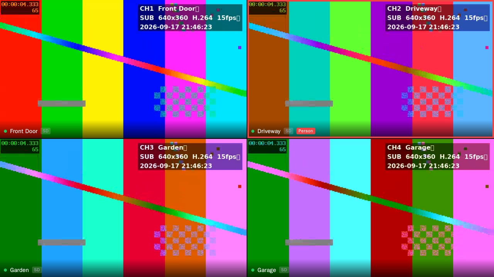
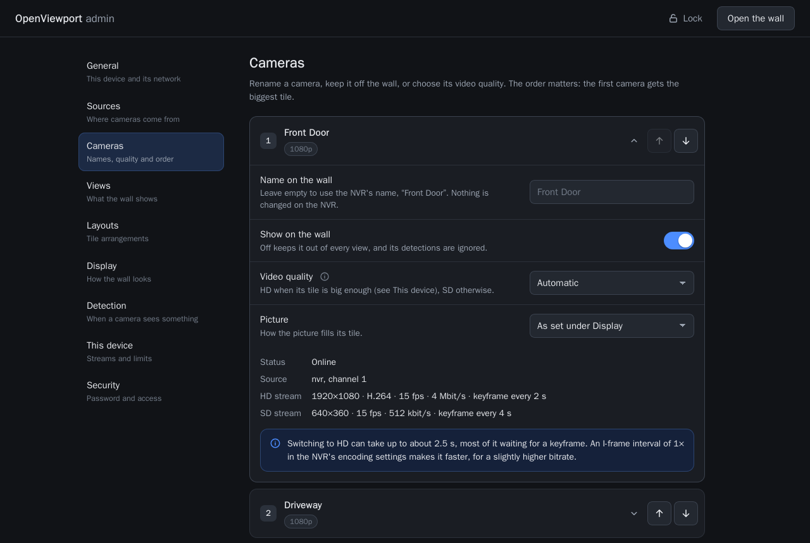
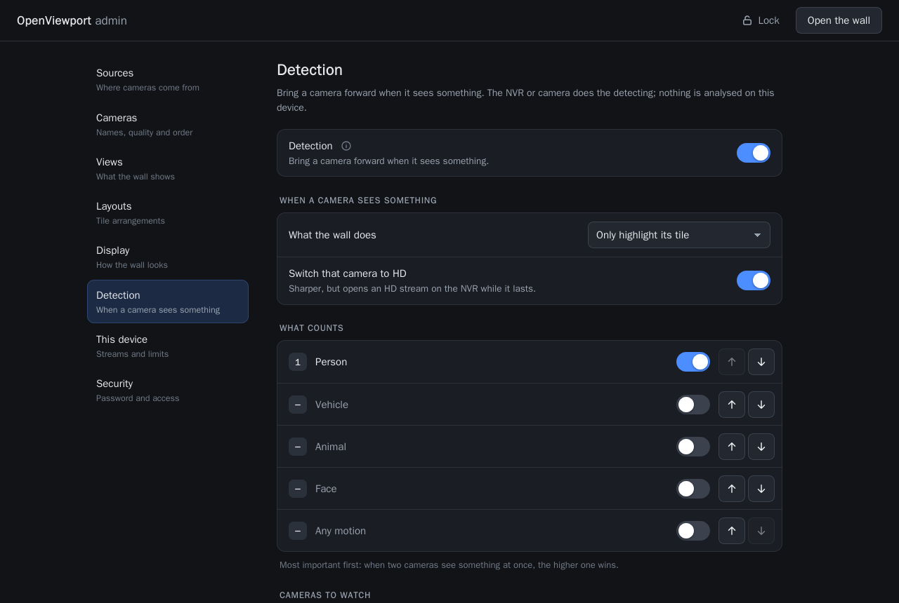
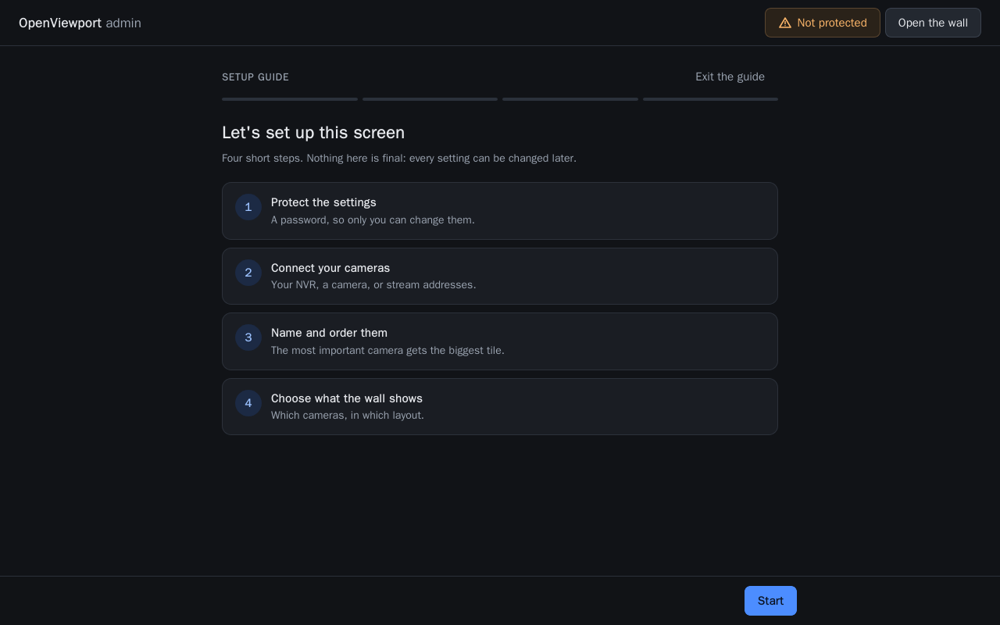
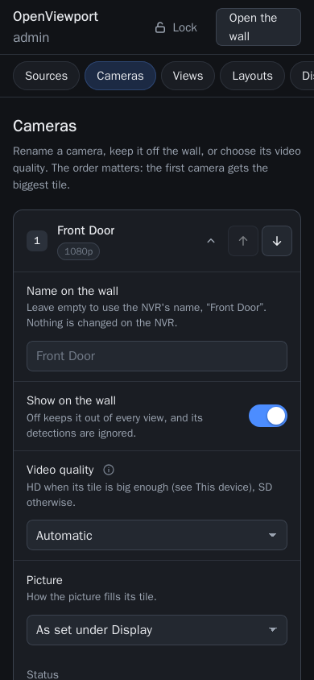
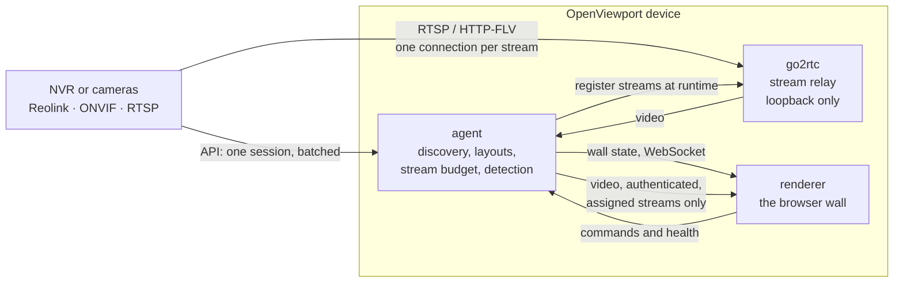

# OpenViewport

A live camera wall for a TV. Plug a small computer into a screen — a Raspberry Pi, a mini PC,
anything that runs Docker — and it shows your cameras, all the time, **without putting extra
load on the recorder**. Reolink natively, ONVIF for most other brands, plain RTSP for anything
else.



## Why it works this way

An NVR will serve a few streams and then start dropping them. A Reolink allows **two
full-resolution viewers and ten low-resolution viewers per camera** — and the owner's phone app
needs one of them. A wall that naively opens sixteen full-resolution streams does not just run
slowly: it breaks recording and locks you out of your own cameras.

So the agent decides, centrally, how few streams can be open and which tile gets which. Tiles
use the low-resolution stream unless they are big on screen; **one** full-resolution stream
plays at a time by default, leaving the phone app its slot; streams are held briefly rather
than churned; and a screen physically cannot ask for more, because video is relayed by the
agent, which refuses any stream it has not assigned.

## Quick start

```bash
cp .env.dev.example .env
docker compose up -d --build
```

| URL | What |
|---|---|
| http://localhost:8080 | The camera wall |
| http://localhost:8080/?hud=1 | …with the status panel (or press `i`) |
| http://localhost:8080/admin | The settings |
| http://localhost:8081 | The built-in mock NVR |

Four test-pattern cameras appear within a few seconds, using the same RTSP paths, HTTP-FLV URLs
and API as a real Reolink NVR — so you can see the whole thing working before you touch your
own cameras. When you are ready for those, see **[installation](docs/installation.md)**, and
read **[security](docs/security.md)** before putting it on a network.

### On the wall

| Input | Action |
|---|---|
| Click a tile, `Enter`, `1`–`9` | Full screen — that tile switches to the full-resolution stream |
| Click again, `Esc` | Back to the grid |
| `←` `→` | Select a tile; moves between cameras while full screen |
| `[` `]`, `PgUp` `PgDn` | Previous / next view |
| `i` | Status panel: stream, resolution, frames, dropped, delay, budget |

Views are sets of cameras in a layout: 13 built-in layouts from `1x1` to `5x5`, feature layouts
like `1+5`, and your own built by dragging cells together. `auto` follows the camera count, so
three cameras give `1+2` rather than `1+5` with three empty tiles.

A camera that sees a person, vehicle, animal or motion comes forward on its own — full screen,
moved into the big tile, or simply highlighted, as in the picture above. It reacts to something
*arriving* rather than to a car that has been parked on the drive since this morning. Touching
the wall always wins: detection pauses while someone is using it.

## The admin page

Everything is configured in the browser, on a phone as comfortably as on a laptop. Nothing
needs a text editor, and no setting requires a restart.



Each camera gets a name for the wall, a switch to keep it off the wall entirely, a video
quality of its own — always HD, always SD, or automatic — and how its picture fills the tile.
Underneath, what the NVR actually reports: resolution, codec, bitrate and keyframe interval,
with advice when a slow keyframe interval is what makes switching to HD feel sluggish.

The other sections are **General** (what this device is, how it reaches the network, and how to
restart or reset it), **Sources** (add or remove an NVR while it runs), **Views**, **Layouts**
(a drag-to-merge grid editor), **Display**, **Detection**, **This device** (the stream budget)
and **Security**.



The first time you open it, a short guide walks you through protecting the settings, connecting
your cameras, naming them and choosing what the wall shows.

| | |
|---|---|
|  |  |

Settings are shown but locked until you unlock them with the admin password, so the screen in
the hallway cannot be reconfigured by anyone who walks past it.

## On a Raspberry Pi

```bash
git clone <this repository> ~/openviewport && cd ~/openviewport
sudo deploy/pi/install.sh
```

One command sets up the whole appliance: the stack and a full-screen browser as services that
start at boot, a token so only the screen itself can watch, and the settings reachable from
your phone at `http://<the pi>.local:8080/admin`. See **[Raspberry Pi](docs/raspberry-pi.md)**.

## How it works



The agent decides everything; the renderer draws what it is told and reports what it sees.
Read [architecture](docs/architecture.md) for the reasoning, or [API](docs/api.md) to write a
renderer of your own.

Security was a requirement rather than a later pass: go2rtc is never published, because its API
hands out camera passwords; credentials never reach logs, API responses, the settings file or
the screen; the pages run under a strict content security policy and refuse cross-site requests
and DNS rebinding; every container is read-only and without capabilities; the wall is on
loopback until you publish it deliberately. [Security](docs/security.md) has the details.

## Documentation

| | |
|---|---|
| [Installation](docs/installation.md) | Docker, your NVR, putting it on a screen |
| [Raspberry Pi](docs/raspberry-pi.md) | The appliance: one installer, services at boot, a kiosk on the TV |
| [Configuration](docs/configuration.md) | Every setting |
| [Supported hardware](docs/hardware/README.md) | What works, which adapter, tested devices |
| [Architecture](docs/architecture.md) | How and why |
| [API](docs/api.md) | HTTP and WebSocket reference |
| [Security](docs/security.md) | A safe installation, the admin lock, what is defended |
| [Credentials](docs/credentials.md) | How passwords are stored, and the limits of that |
| [Troubleshooting](docs/troubleshooting.md) | When something is black or broken |
| [Adding a vendor](docs/adding-a-vendor.md) | Writing a source adapter |
| [Building](docs/building.md) | Working on the code |

## Contributing

Hardware reports are especially welcome: the model, the firmware, and what it did. Everything
is tested in containers, so nothing needs installing on your machine:

```bash
docker compose --profile test run --rm unit
docker compose --profile test run --rm lint
sh scripts/e2e.sh
```

[Contributing](CONTRIBUTING.md) and [building](docs/building.md) cover the code;
[SECURITY.md](SECURITY.md) is how to report something that should not be public.

## Licence and trademarks

[GNU AGPL-3.0](LICENSE). Use it, change it, run it at home freely. If you modify it and let
other people use it — including over a network — those people are entitled to your changes
under the same licence.

Not affiliated with, endorsed by or connected to Ubiquiti, Reolink, or any other manufacturer.
Their product names appear here only to say which devices this software talks to.
